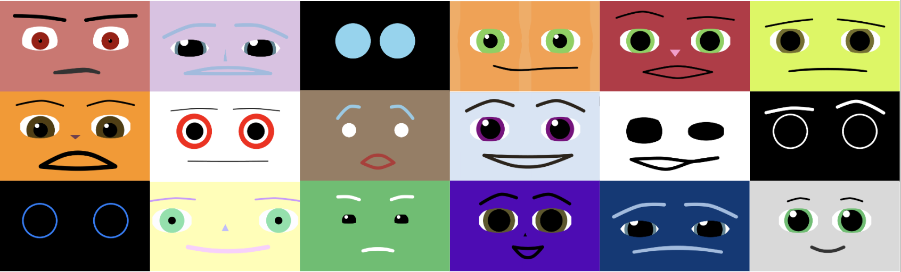

Welcome to PyLips's documentation!
===================================

**PyLips** is a Python-based interface for developing screen-based conversational agents.
It is designed to make developing socially assistive robotics easier by providing a
simple, expressive, and customizable framework for developing conversational agents.

PyLips is easy to install, simple to use, and open-source.
It comes ready to use with your system's speech synthesis tools, and
uses other free and open-source software for turning these sounds into facial expressions.
Check out the :doc:`usage` section for installation instructions, or fork me on
Github_.

.. _Github: https://github.com/interaction-lab/PyLips

.. note::

   This project is under active development. Please raise an issue on github if you are having any trouble!

Contents
--------

.. toctree::
   :maxdepth: 4
   :hidden:
   :includehidden:

   usage
   tutorials
   api
