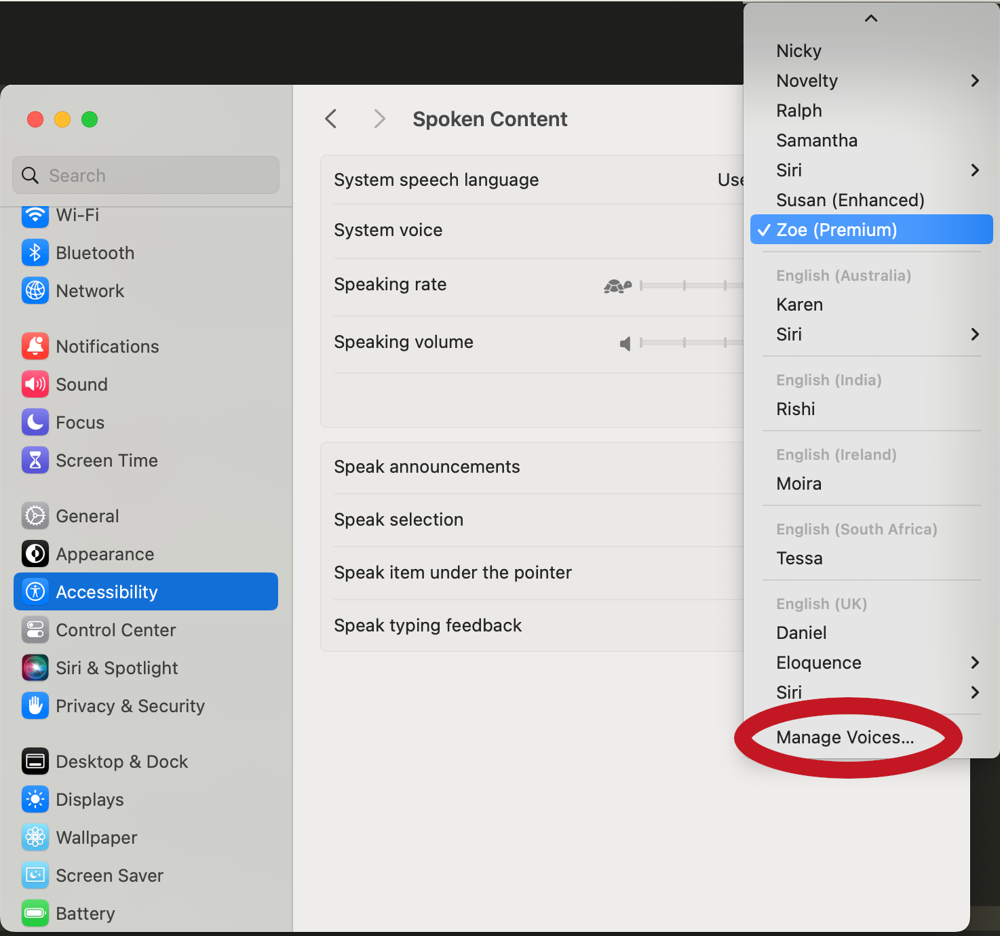

Changing the Voice
=====

You may not like your default system voice, and that's okay! PyLips allows you to change the voice.
To see the available voices on your system, run the following code:

.. code-block:: python

   from pylips.speech import RobotFace

   face = RobotFace()
   face.tts.list_voices()

This will print a list of available voices. To change the voice, you can pass the voice name to the
RobotFace constructor. For example, to use the voice ``com.apple.voice.premium.en-US.Zoe``, you can run:

.. code-block:: python

   from pylips.speech import RobotFace

   face = RobotFace(voice_id='com.apple.voice.premium.en-US.Zoe')

You can replace ``com.apple.voice.premium.en-US.Zoe`` with any of the voices you found in the previous step.
The voices that are available to you will depend on your system.

Adding Voices on Mac
----------------

If you're on a Mac, you can add more voices by going to:

``System Preferences -> Accessibility -> Spoken Content -> System Voice -> Manage Voices...``

It should look like this:

Once you press this, you can listen to the options and download the voices you like. Once you have done this,
they will be automatically available for use. You can find their names by running the code above.
