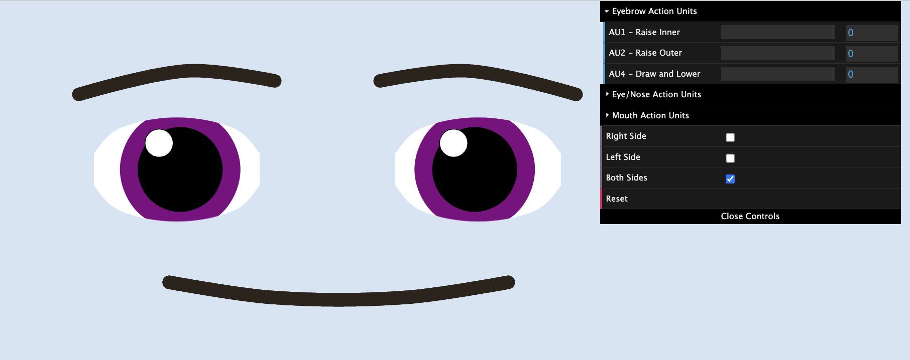

Emoting with PyLips
=====

You can control your robot's facial expressions using PyLips. The PyLips interface for specifying
facial expressions uses the `Facial Action Coding System <https://en.wikipedia.org/wiki/Facial_Action_Coding_System>`_ 
(FACS). FACS is a system for describing facial expressions in terms of the actions of facial muscles. 

We provide a web page for you to try out different facial expressions and see how FACS codes change the face.
You can access the web page at ``http://localhost:8080/editor`` after starting the PyLips server with the command
``python3 -m pylips.face.start``. You will see an interface with sliders for each FACS codes. You can move the sliders
to see how the face changes. You can also select which side to apply the FACS code to by clicking the buttons on the
bottom of the menu.

To send a facial expression to the robot, you can use the ``express()`` method of the ``RobotFace`` class. 
The ``express()`` method takes a dictionary of FACS codes as input. The keys of the dictionary are the FACS codes
and the values are the intensity of the action. The intensity should be a number between 0 and 1.

Here is an example of how to use the ``express()`` method to raise the face's eyebrows:

.. code-block:: python

    from pylips.speech import RobotFace

    face = RobotFace()
    face.express({'AU1': 0.2, 'AU2': 0.5}, 1000)

You can also perform one-sided facial expressions. To do that, just append an 'l' or an 'r' to the FACS code.
For example, to lower the left eyebrow, you can use the following code:

.. code-block:: python

    from pylips.speech import RobotFace

    face = RobotFace()
    face.express({'AU1l': 0.0, 'AU2l': 0.0, 'AU4l': 1.0}, 1000)

The sides are based on the robot's perspective, so 'l' refers to the robot's left side and 'r' refers to 
the robot's right side.

Another note is that the Action Units 10, 13, 14, 16, 18, 20, 23, 24, 25, 26, and 27 are used to make visemes for the robot's speech.
So, if you use these Action Units in the ``express()`` method while the robot is talking, the robot may exhibit some 
strange behaviors.